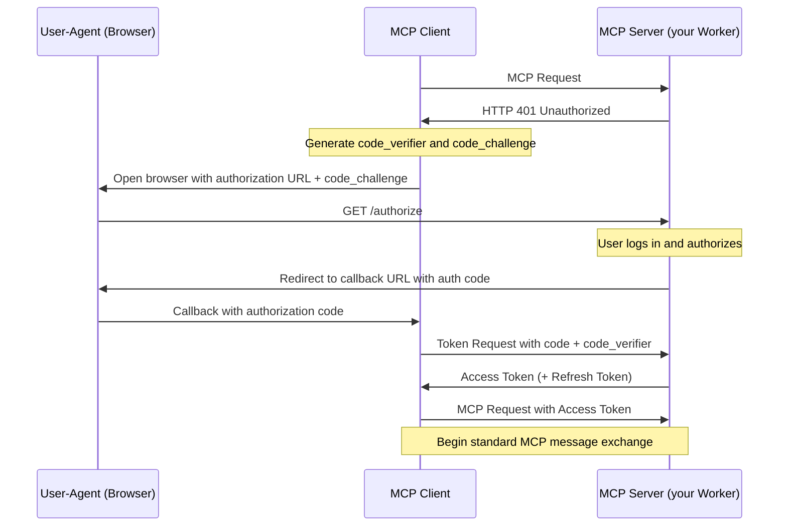
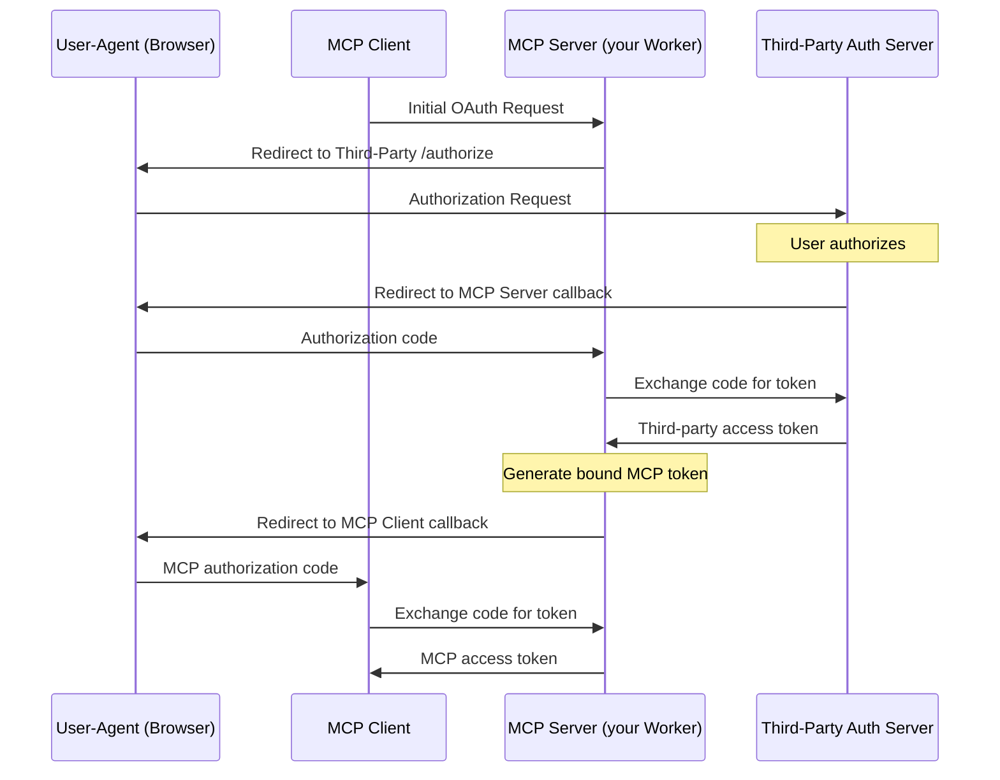

import { DirectoryListing } from "~/components";

When building a [Model Context Protocol (MCP)](https://modelcontextprotocol.io) server, you need both a way to allow users to login (authentication) and allow them to grant the MCP client access to resources on their account (authorization).

<diagram>

</diagram>

The Model Context Protocol uses [a subset of OAuth 2.1 for authorization](https://spec.modelcontextprotocol.io/specification/draft/basic/authorization/). OAuth allows your users to grant limited access to resources, without them having to share API keys or other credentials.

Cloudflare provides an [OAuth Provider Library](https://github.com/geelen/mcp-remote-examples/tree/main/.vendor/workers-oauth-provider) that implements the provider side of the OAuth 2.1 protocol, allowing you to easily add authorization to your MCP server.

You can use the OAuth Provider Library in three ways:

1. **Your Worker handles authorization itself.** Your MCP server, running on Cloudflare, handles the complete OAuth flow. ([Example](/agents/model-context-protocol/mcp-server/getting-started/))
2. **Integrate with a third-party OAuth provider**, such as GitHub or Google. ([Example](/agents/model-context-protocol/mcp-server/examples/third-party-oauth-provider/))
3. **Integrate with your own OAuth provider**, including authorization-as-a-service providers such as Stytch and Auth0. ([Example](/agents/model-context-protocol/mcp-server/examples/external-oauth-provider/))

The following sections describe each of these options and link to runnable code examples for each.

## Authorization options

### (1) Your MCP Server handles authorization itself

Your MCP Server, using the Cloudflare [MCP Server SDK](/agents/model-context-protocol/mcp-server/getting-started/) and [OAuth Provider Library](/agents/model-context-protocol/mcp-server/authorization/oauth-provider-api-reference/), can handle the complete OAuth authorization flow, without any third-party involvement.

The [Workers OAuth Provider Library](/agents/model-context-protocol/mcp-server/authorization/oauth-provider-api-reference/) is a Cloudflare Worker that implements a [`fetch()` handler](/workers/runtime-apis/handlers/fetch/), and handles incoming requests to your MCP server. You provide your own handlers for your MCP Server's API, and autentication and authorization logic, and URI paths for the OAuth endpoints, and the SDK handles the rest.

{/* TODO: Update link */}
The OAuth Provider Library comes with an [example handler implementation](https://github.com/geelen/mcp-remote-examples/tree/main/02-user-password/src/routes) for autentication and authorization, referenced below as `defaultHandler`:

{/* TODO: GithubCodeComponent */}

```ts
import OAuthProvider from "workers-oauth-provider";

// TODO: Bunch of naming decisions here
export default new OAuthProvider({
	apiRoute: "/mcp",
	// Your MCP server:
	apiHandler: MyMCPServer.Router,
	// Your handler for authentication and authorization:
	defaultHandler: OAuthProvider.defaultHandler,
	// TODO: Should these have default values?
	authorizeEndpoint: "/authorize",
	tokenEndpoint: "/token",
	clientRegistrationEndpoint: "/register",
});
```



Remember — [authentication is different from authorization](https://www.cloudflare.com/learning/access-management/authn-vs-authz/). Your MCP Server can handle authorization itself, while still relying on an external authentication service to first authenticate users. The [example](/agents/model-context-protocol/mcp-server/) in getting started provides a mock authentdcation flow. You will need to implement your own authentication handler — either handling authentication yourself, or using an external authentication service such as Clerk, Stytch, Auth0 or others.

For a step-by-step example, refer to the [Worker as OAuth Provider](/agents/model-context-protocol/mcp-server/authorization/worker-as-oauth-provider/) section., and refer to the [API reference docs for the OAuth Provider SDK](/agents/model-context-protocol/mcp-server/authorization/oauth-sdk/).

### (2) Third-party OAuth Provider

The OAuth Provider Library can be configured to use a third-party OAuth provider, such as [GitHub](https://docs.github.com/en/apps/oauth-apps/building-oauth-apps/creating-an-oauth-app) or [Google](https://developers.google.com/identity/protocols/oauth2).

When you use a third-party OAuth provider, you must provide a handler to the `OAuthProvider` that implements the OAuth flow for the third-party provider.

```ts
import OAuthProvider from "workers-oauth-provider";
import MyAuthHandler from "./auth-handler";

// TODO: Bunch of naming decisions here
export default new OAuthProvider({
	apiRoute: "/mcp",
	// Your MCP server:
	apiHandler: MyMCPServer.Router,
	// Your handler for authentication and authorization with the third-party provider:
	defaultHandler: MyAuthHandler,
	// TODO: Should these have default values?
	authorizeEndpoint: "/authorize",
	tokenEndpoint: "/token",
	clientRegistrationEndpoint: "/register",
});
```

Note that as [defined in the Model Context Protocol specification](https://spec.modelcontextprotocol.io/specification/draft/basic/authorization/#292-flow-description) when you use a third-party OAuth provider, the MCP Server (your Worker) generates and issues its own token to the MCP client:



Read the docs for the [Workers oAuth Provider Library](/agents/model-context-protocol/mcp-server/authorization/oauth-provider-api-reference/) for more details.

### (3) Bring your own OAuth Provider

If your application already implements an Oauth Provider itself, or you use Stytch, Auth0, or authorization-as-a-service provider, you can use this in the same way that you would use a third-party OAuth provider, described above in (2).

The following examples show how to use the OAuth Provider Library with an external OAuth provider:

- [Stytch](/agents/model-context-protocol/mcp-server/examples/stytch/)
- [Auth0](/agents/model-context-protocol/mcp-server/examples/auth0/)

## Next steps

- [Learn how to use the OAuth Provider SDK](/agents/model-context-protocol/mcp-server/authorization/oauth-provider-api-reference/)
- [Learn how to use a third-party OAuth provider](/agents/model-context-protocol/mcp-server/examples/third-party-oauth-provider/)
- [Learn how to bring your own OAuth provider](/agents/model-context-protocol/mcp-server/examples/external-oauth-provider/)
